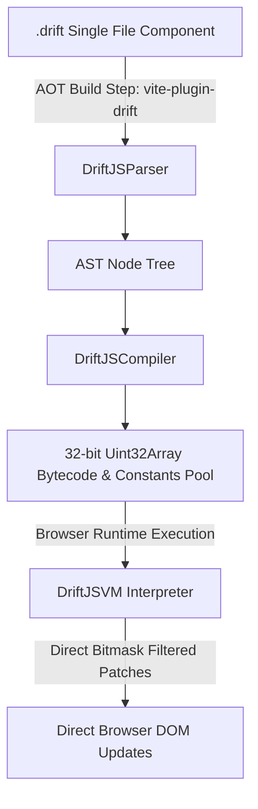

# DriftJS ⚡

> **A Register VM-Based Reactivity Engine & AOT Compiler for High-Performance UI**

> [!IMPORTANT]
> **Project Status**
> DriftJS is currently in an **early experimental stage**, _and not yet production-ready._
> The core bytecode architecture, register VM, and AOT compiler foundation _may not be_ functional. But, I warmly invite the open-source community to collaborate, test, and help evolve DriftJS into a production-grade framework!

---

## 🌟 Key Architectural Features

- **Bytecode & Register VM Architecture**: Replaces VDOM diffing and proxy overhead with a linear 32-bit instruction stream running on a low-latency fetch-decode-execute loop.
- **Direct DOM Patching**: State updates mutate register slots directly. Guarded thunk execution (`EXEC_THUNK_GUARDED`) skips unneeded DOM updates using bitfield dependency masks (`dirtyMask`).
- **Single-File Component (`.drift`) Support**: Author components in single `.drift` files combining `<script>` logic and template markup.
- **Build-Time AOT Compiler (`vite-plugin-drift`)**: Compiles `.drift` templates into binary `Uint32Array` bytecode streams at build time in Vite/Rollup—shipping zero parser overhead to the client browser.
- **Cross-Platform Potential**: Because templates compile down to raw 32-bit instruction streams, the VM can be re-implemented natively in Kotlin (Android) or Swift (iOS) to drive native mobile UI views with zero bridge serialization overhead.

---

## 🚀 Quick Start

### 1. Installation

```bash
npm install @driftjs/runtime
npm install -D @driftjs/vite-plugin
```

### 2. Configure Vite (`vite.config.ts`)

```typescript
import { defineConfig } from 'vite';
import { driftPlugin } from '@driftjs/vite-plugin';

export default defineConfig({
  plugins: [driftPlugin()]
});
```

### 3. Create a Component (`App.drift`)

```html
<script>
  let userInput = "Hello DriftJS!";

  function handleInput(e) {
    userInput = e.target.value;
  }
</script>

<div id="container" class="my-app">
  <h1>{userInput}</h1>
  <input type="text" value={userInput} oninput={(e) => handleInput(e);} />
</div>
```

### 4. Mount the Component (`main.ts`)

```typescript
import { mount } from '@driftjs/runtime';
import App from './App.drift';

const appElement = document.getElementById('app')!;
mount(App, appElement);
```

---

## 📦 Packages in this Monorepo

| Package | Description |
| :--- | :--- |
| **`@driftjs/compiler`** | Lexer, parser, analyzer, and AST bytecode generator |
| **`@driftjs/runtime`** | Bytecode-driven Register VM runtime reactivity engine |
| **`@driftjs/vite-plugin`** | Vite plugin for compiling `.drift` templates to VM bytecode AOT |

---

## ⚙️ How It Works Under The Hood



Instructions are encoded into fixed-width 32-bit words:
`[ Opcode (8-bit) | Register A / Node (8-bit) | Register B / Constant (8-bit) | Register C / Offset (8-bit) ]`

For the complete 16-opcode instruction set specification, hex encodings, and operand layouts, see the [DriftJS ISA Specification](docs/ISA.md).

---

## 🛠️ Monorepo Development

```bash
# Install dependencies
pnpm install

# Type-check workspace
pnpm lint

# Build all packages into dist/
pnpm build

# Run unit test suite
pnpm test
```

---

## 📜 License

MIT
